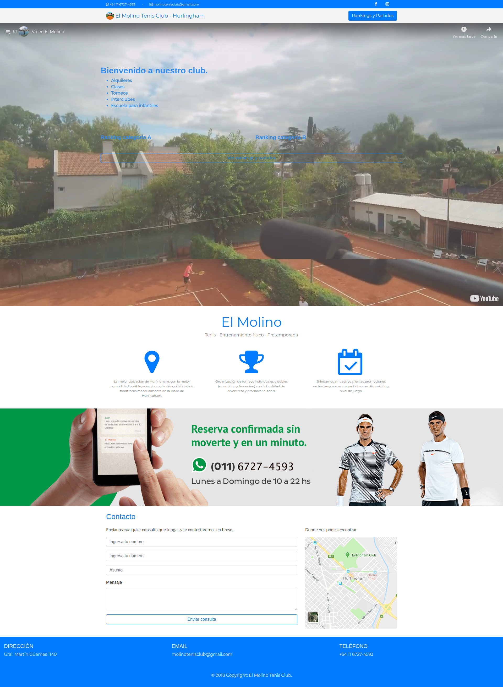

<h1 align="center">
   
  
   
  El Molino - Frontend
   
</h1>
<h4 align="center">
  <a href="https://github.com/martinbobbio/backend-molino-tenis">El Molino - Backend</a>
   -  
  <a href="https://github.com/martinbobbio/app-molino-tenis">El Molino - APP</a>
</h4>

# Descripción

Página comercial para el Molino tenis de Hurlingham.
Tecnologias: Angular y Bootstrap

# Capturas

### Inicio

